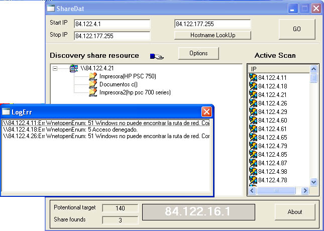



## sharenet

### Description

it is a windows shared scanner,it use function wnetresourceenum,wnetopenenum,wnetcloseenum,ect..

is very easy use de api,the applicantion have a option for i give more o less speed to progran,and you can enum of files ect.. you see the screenshot

chao
 
### More Info
 

             |
---                |---
**Submitted On**   |2005-03-22 18:22:02
**By**             |[Manuel\(ErcUn\)](https://github.com/Planet-Source-Code/PSCIndex/blob/master/ByAuthor/manuel-ercun.md)
**Level**          |Intermediate
**User Rating**    |4.8 (19 globes from 4 users)
**Compatibility**  |VB 5\.0, VB 6\.0
**Category**       |[Complete Applications](https://github.com/Planet-Source-Code/PSCIndex/blob/master/ByCategory/complete-applications__1-27.md)
**World**          |[Visual Basic](https://github.com/Planet-Source-Code/PSCIndex/blob/master/ByWorld/visual-basic.md)
**Archive File**   |[sharenet1866793222005\.zip](https://github.com/Planet-Source-Code/manuel-ercun-sharenet__1-59591/archive/master.zip)

